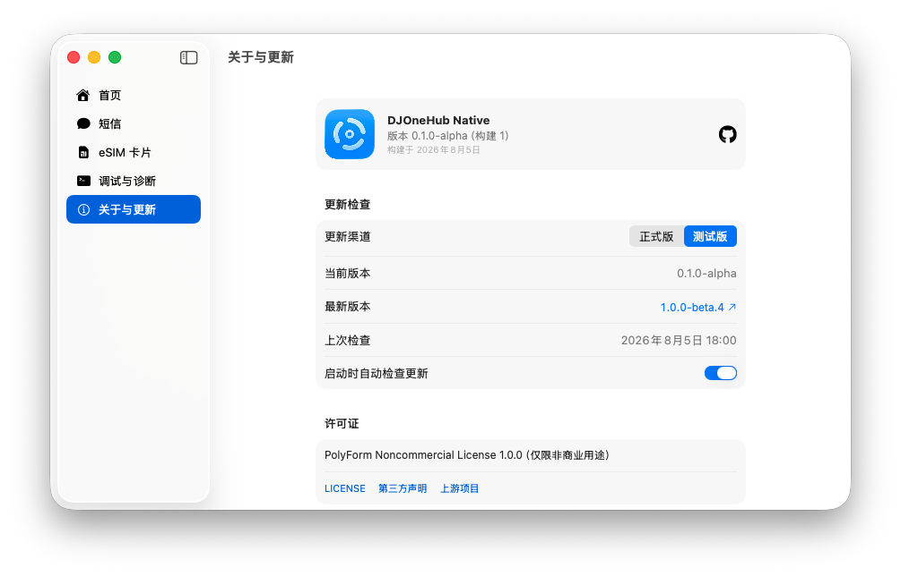

<p align="center">
  <picture>
    <source media="(prefers-color-scheme: dark)" srcset="docs/AppIcon-dark.png">
    
  </picture>
</p>

<h1 align="center">DJOneHub</h1>

<p align="center">
  <a href="LICENSE"></a>
  
  
  
  <a href="https://github.com/cr-zhichen/DJOneHubNative/releases"></a>
</p>

## 简介

DJOneHub 是大疆第一代 4G 模块管理工具的原生 macOS 重制版。SwiftUI 前端与 Go 后端通过 Unix domain socket 通信，在一个应用中完成模块状态查看、短信与 eSIM 管理、网络分流、蜂窝通话、来电提醒和调试诊断。

项目由 [ZenGeekLabs/DJOneHub](https://github.com/ZenGeekLabs/DJOneHub)（源自 [iniwex5/vohive](https://github.com/iniwex5/vohive)）改造而来，保留上游 Go 核心逻辑，并以原生 SwiftUI 界面替代 Web 套壳。

## 功能

| 模块 | 功能 |
| --- | --- |
| 首页与网络 | 模块、SIM、信号和设备信息；本次与累计流量；USB 网卡开关、网络服务排序、4G 默认出口检查和模块重启；**自动故障切换始终开启**（Wi‑Fi 不可用时切到 DJ‑4G，恢复后切回；不关闭 Wi‑Fi、不退出 Quantumult X） |
| 短信 | 会话收发与回复、单条删除、验证码标记；SIM / 模块存储扫描与选择性清理；短信接管、本机归档和系统通知 |
| eSIM | 实体 SIM / eUICC 识别、卡片与 Profile 信息；Profile 下载、启用、改名和删除；号码资料与模块通讯录检测 |
| 通话 | 独立通话页面与首次启用引导；拨号、接听、挂断、Mac 麦克风与扬声器桥接、来电卡片、铃声、通话记录，以及配置备份的导入、导出、删除与安全还原 |
| 应用分流 | 独立分流支持默认及分应用选择 4G 直连、系统直连或系统 SOCKS5；包含 SOCKS5 握手与认证检测、运行预检、TUN 冲突检测和权限服务管理 |
| Clash 代管 | 提供本地 4G SOCKS5 出口，可配置监听端口并复制 Clash 配置 |
| 应用与菜单栏 | 开机自启、静默启动、关闭窗口后后台运行；Dock 点击可重新打开主窗口；菜单栏可显示蜂窝信号格，以及上下两行实时网速（上↑上行、下↓下行，紧凑单位如 `1022B` / `3.9K`） |
| 调试与更新 | 网络诊断、AT 指令、通知模拟和窗口兼容模式；一键复制 / 清空诊断日志；正式版 / 测试版渠道、手动或自动更新检查及版本跳过 |

## 网络优先级与自动故障切换

底层出口顺序一般为 **Wi‑Fi → DJ‑4G → 有线 → Thunderbolt Bridge**，**Quantumult X 等 VPN 作为上层代理排在最后**，故障切换不会关闭代理。

- 启动后自动故障切换默认开启，界面不提供关闭开关。请在首页「网卡优先级」中排好顺序并「应用顺序」（首次需管理员授权安装助手）。
- **Wi‑Fi 当前不可用**（链路断开或探测失败）时提升 DJ‑4G；Wi‑Fi 恢复后切回。不会去关闭 Wi‑Fi 硬件。
- 切到底层备选或从备选切回时，会短暂开关一次 Quantumult 网络服务，促使代理重绑底层，而不是退出 Quantumult。
- USB 模块常见「假活」：Mac 上 `en8` 已有 `192.168.225.x`，但网关 ARP 为 `incomplete`，或网关通却无法出公网。恢复顺序优先 **ARP 刷新 → DHCP 续约 → 重建 PDP（`AT+CGACT`）→ 射频开关（`AT+CFUN=0/1`）**；**整机软重启 `AT+CFUN=1,1` 仅作最后手段且后台进行**，避免卡住界面与诊断接口。主网卡正常时只做快修维护备选，不软重启。
- 切勿对 AppleUserECM（模块 USB 网卡）做 `ifconfig down/up`，会弄死链路。

诊断报告可在首页或「调试与诊断 → 网络诊断」中 **清空日志** / **复制诊断日志**。日志文件为 `~/Library/Application Support/DJOneHubNative/djonehub-diagnostic.log`。

## 界面预览

| 首页 | 关于与更新 |
| --- | --- |
|  |  |

## 接入准备

- 大疆第一代 4G 模块
- 可正常使用的实体 SIM，或与当前实现兼容的实体 eUICC / eSIM 卡片
- 支持数据传输的 USB-C 线缆
- Apple Silicon 或 Intel Mac，macOS 13.0 及以上

模块的 USB 设备标识通常为 `2ca3:4006`。连接后若 macOS 完全识别不到设备，请先确认线缆支持数据传输。

| 指示灯 | 常见含义 |
| --- | --- |
| 红色常亮 | 未插入 SIM 卡 |
| 红色闪烁 | SIM 卡未被正常识别 |
| 绿色常亮 | SIM 已识别，蜂窝信号通常较好 |
| 绿色闪烁 | SIM 已识别，蜂窝信号可能较弱或仍在注册 |

## 通话模式

通话页支持拨号、接听和挂断，并通过 Mac 的麦克风与扬声器传输语音。首次启用时，应用会在用户确认后备份模块配置、开启通话所需接口、重启模块，并下载和校验适配 QDC507 的语音运行时；运行时仅部署到临时目录，不写入模块闪存。

配置备份可在通话页导入、导出和删除，也可在设备身份匹配且没有通话进行时安全还原。导入只保存通过格式与一致性校验的 JSON，不会立即修改模块；还原前会再次备份当前配置，过程中可能重启模块并暂时中断网络、短信和 eSIM 操作。

首次启用可能持久修改 USB 组合并授权 ADB。当前语音运行时仅支持模块内核 `3.18.44`；实际通话仍取决于 SIM、套餐以及运营商的蜂窝语音或 VoLTE 支持。

## 安装与运行

从 [GitHub Releases](https://github.com/cr-zhichen/DJOneHubNative/releases) 下载适合当前架构的 DMG，将 App 拖入“应用程序”文件夹即可。发行版采用 ad-hoc 签名且未公证；若首次启动提示“无法验证开发者”，请先尝试打开一次，再前往“系统设置 → 隐私与安全性”点击“仍要打开”。

应用启动时会自动启动后端服务；关闭主窗口后仍在菜单栏运行，通过“退出 DJOneHub”才会停止服务。应用分流默认关闭，独立分流首次启用或更新权限服务时需要管理员授权。

运行日志位于 `~/Library/Application Support/DJOneHubNative/djonehub.log`。故障切换与网络诊断日志位于同目录下的 `djonehub-diagnostic.log`；自动切换状态保存在 `network-failover.json`。

## 构建

```sh
mise install                # 安装 mise.toml 固定的 Go 版本
mise run build              # 构建当前架构的 .app
mise run build:universal    # 构建 arm64 + x86_64 通用包
mise run launch             # 启动已构建的 app
mise run backend:test       # 运行后端测试
mise run clean              # 清理 build/ 与 dist/
```

需要 `mise`、Xcode 26 或更新版本、`pkg-config`、`libusb`、`git`，以及首次构建时可访问 GitHub 的网络。构建脚本会从固定提交编译独立的 sing-box 网络核心；发行版提供 universal、arm64 和 x86_64 三种 DMG。

## 验证范围

项目目前主要在 macOS 26.5.2、Apple M5 Pro、Xcode 26.6 和 Go 1.26.3 环境下开发与测试。最低部署目标为 macOS 13，但 macOS 13–25 尚未完成同等范围的真实设备验证。

API 模型与端点已通过无硬件环境自动验证（`app/Tests/APIProbe`）；短信、eSIM 写入、蜂窝链路和独立分流等完整功能仍需对应硬件与网络环境验证。2026-08-14 已在 QDC507 模块上完成通话模式初始化、运行时下载校验、语音路由、Mac 音频输入输出和重启后恢复验证；由于缺少另一部测试电话，运营商侧呼叫建立及双方实际可听仍待验证。

## 文档

- [`docs/MODULE_RESEARCH.md`](docs/MODULE_RESEARCH.md)：模块识别、USB ID 恢复、语音调查与 AT 指令
- [`docs/ARCHITECTURE.md`](docs/ARCHITECTURE.md)：架构、关键设计决策与开发记录

## 许可证

本项目继承上游的 PolyForm Noncommercial License 1.0.0，仅限非商业用途，并保留上游声明 `Copyright iniwex5 (https://github.com/iniwex5/vohive)`。详见 [LICENSE](LICENSE) 与 [THIRD_PARTY_NOTICES.md](THIRD_PARTY_NOTICES.md)。

## 社区

本项目的开发契机源于 [LINUX DO](https://linux.do/) 社区。在社区中了解到大疆第一代 4G 模块后，开始进行相关研究并开发 DJOneHub 的原生 macOS 版本。

作者社区主页：[zgccrui](https://linux.do/u/zgccrui)

## 致谢

感谢以下项目及其贡献者：

- DJOneHubNative 基于 [ZenGeekLabs/DJOneHub](https://github.com/ZenGeekLabs/DJOneHub) 开发，保留了其 Go 核心，并将原有 Web 界面重构为原生 SwiftUI 应用。
- [iniwex5/vohive](https://github.com/iniwex5/vohive) 是 DJOneHub 的上游项目，本项目沿用了其中的核心实现与许可证声明。
- 通话功能的实现参考了 [rogerbush007-a11y/DJOneHub-mac-enhanced](https://github.com/rogerbush007-a11y/DJOneHub-mac-enhanced) 提供的方案。
